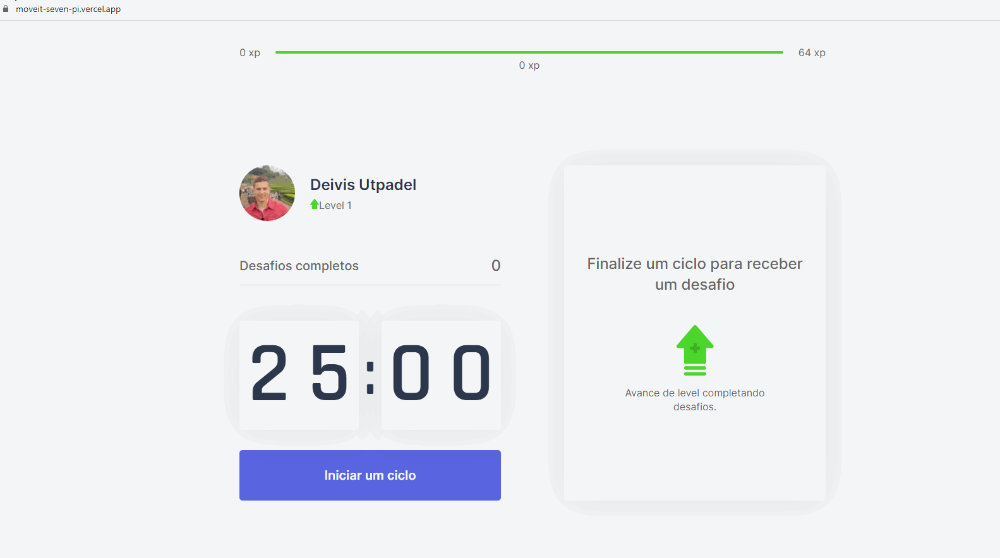

## Demo 📸

  

## Sobre o Projeto

Esta aplicação fornece ao usuário uma ferramenta de controle para uma técnica chamada pomodoro.

A Técnica Pomodoro é um método para gerenciar o tempo que você utiliza para exercer tarefas, podendo ser na área dos estudos ou do trabalho.

A proposta é que você cronometre e foque totalmente no que está executando até que chegue o momento de sua pausa. 
É utilizado um cronômetro para dividir o trabalho ou estudo em períodos de 25 minutos com breves intervalos entre eles.
Todo o método vai intercalando entre períodos estudados e intervalos de descanso com desafios de exercicios ergonômicos para te auxiliar a aliviar a tensão.

Para ver o **App web**, clique aqui: [Move it Web](https://github.com/deivisutp/move-it)  

### 🛠 Tecnologias

As seguintes ferramentas foram usadas na construção do projeto:

- [TypeScript]
- [NextJS]
- [React Context Provider]

---

 

Linkedin: (https://www.linkedin.com/in/deivis-utpadel-2b2b7948/)
